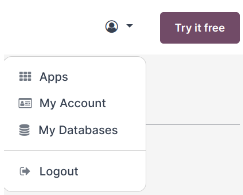
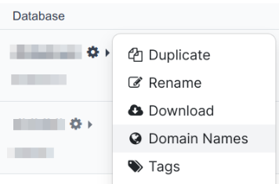
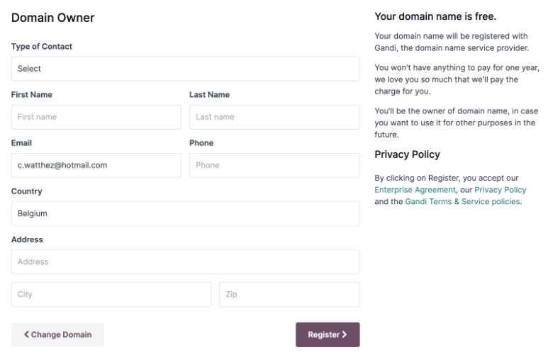
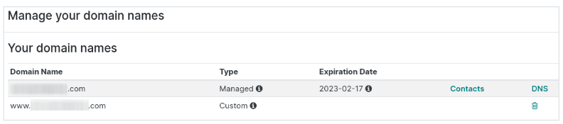

============
Domain names
============

A **domain name** is a unique internet address that identifies a specific website. It allows website
access by translating numeric IP addresses into human-readable text-based names.

**Odoo Online** and **Odoo.sh** databases, including their websites, use by default a **subdomain**
of odoo.com for both the URL and the emails (e.g., mycompany.odoo.com). A subdomain is a
domain that is a part of another domain. It often refers to the part before the main domain name.
Traditionally, most websites use the `www.` subdomain, but any string of letters can be used as well.
You can use subdomains to direct your visitors to websites other than your main
website or specific pages.

You can use a **custom domain name** to access your Odoo database and websites:

- By :ref:`registering a free domain name with Odoo <domain-name/odoo-register>` (for Odoo Online
  databases);
- By :ref:`configuring a custom domain that you already own <domain-name/existing>`.

.. tip::
   - Odoo offers a :ref:`free custom domain name <domain-name/odoo-register>` to all Odoo Online
     databases for one year.
   - A good domain name is crucial for your brand. To make it effective, keep it simple, short, easy
     to remember, and easy to spell.

.. seealso::
   - `Odoo Tutorials: Register a Free Domain Name
     <https://www.odoo.com/slides/slide/register-a-free-domain-name-1663>`_
   - `Odoo Quick Tips: Get a free domain name! <https://www.youtube.com/watch?v=eAfgeNOHLP4>`_

.. _domain-name/odoo-register:

Register a free domain name with Odoo
=====================================

When creating your site on Odoo, you can get free domain registration for the first year. After
this period, Odoo continues to manage your domain in partnership with **Gandi**, the domain name
registrar, and you will be charged at the renewal rates as indicated on `their site (renewal column)
<https://www.gandi.net/en/domain>`_. Odoo then sends a renewal quotation every year to the email
address mentioned as the owner a few weeks before the expiration date of the domain. The domain is
renewed automatically when the quotation is confirmed.

.. note::
   - A one-year free domain name is also available for free Odoo Online databases (if you installed
     one app only, for example). In this case, Odoo reviews your request and website to avoid abuse.
     This process can take several days due to the high number of requests.
   - This offer is currently not available for Odoo.sh databases.

**To register a free domain name** with Odoo, click your profile icon on your dashboard, then
:guilabel:`My Databases`.

Click the cron icon next to your database name, then click :guilabel:`Domain Names`.

Search for the domain name of your choice to check its availability.

.. image:: domain_names/register-a-domain-name.png

:guilabel:`Select` the domain name you want to use for your website, fill in the
:guilabel:`Domain Owner` form with your information, and :guilabel:`Register`. Your domain name is
directly linked to your database, but you still have to :ref:`map your domain name with your website
<domain-name/db-map>`.

.. Important::
   After registering a domain, a verification email from noreply@domainnameverification.net is sent
   to the email address you provided. Click the link in the email to verify your email address.
   **Verification is crucial**. If not done:

     - In most cases, your domain will stop working after two weeks until the email is verified;
     - In some cases, your domain might keep working, but you won't receive a renewal notice.

.. _domain-name/odoo-manage:

Manage your domain name registered with Odoo
--------------------------------------------

Domain names are referenced in the **Domain Name System**, or DNS, an Internet directory.

To visualize the :guilabel:`Contacts` associated with your domain names or to manage its **DNS**
records, open your `database manager <https://www.odoo.com/my/databases>`_, click the gear icon next
to your database name, then :guilabel:`Domain names` and :guilabel:`Contacts` or :guilabel:`DNS`.

The :guilabel:`Contacts` column displays the different types of contacts registered for your domain
name. You appear as the :guilabel:`Domain Owner`, and Odoo is automatically set as
:guilabel:`Administrative`, :guilabel:`Technical`, and :guilabel:`Billing` contact.

The :guilabel:`DNS` column displays the DNS zone of your domain names. You can see :guilabel:`Type`
:guilabel:`A` records and create/edit :guilabel:`CNAME`, :guilabel:`MX`, and :guilabel:`TXT` records.

- :guilabel:`A`: indicates the IP address of a given domain. It is automatically created to manage
  the redirection of your naked domain and cannot be edited or deleted.
- :guilabel:`CNAME`: is created by default and maps your subdomain to your database. If you rename
  your database, you have to rename your CNAME.
- :guilabel:`MX`: the purpose of an MX record is to instruct servers on where to deliver emails. You
  can retrieve your MX value from your preferred email service (e.g., `Google Workspace <https://support.google.com/a/answer/174125?hl=en>`_,
  `Outlook <https://learn.microsoft.com/en-us/microsoft-365/admin/get-help-with-domains/create-dns-records-at-any-dns-hosting-provider?view=o365-worldwide>`_,etc.).
- :guilabel:`TXT`: Odoo allows you to create a TXT record for different purposes, e.g., to verify the
  ownership of your domain name.

Any modification to the DNS can take up to **72 hours** to propagate worldwide on all servers.

.. note::
   You can `submit a support ticket <https://www.odoo.com/help>`_ if you need further assistance to
   manage your domain name.

Manage your mailbox
-------------------

The one-year free domain name offer doesn’t include any mailbox. To link your domain name with your
mailbox, there are different options:

**Option 1**

Create a sub-domain (e.g., `subdomain`.example.com) to use as an alias domain for the database. This allows
you to create records in Odoo from emails received on your @`subdomain`.example.com aliases. To do
so, go to your portal, click the gear icon, :guilabel:`Domain Names`, :guilabel:`DNS`, and click
:guilabel:`ADD DNS RECORD` and choose :guilabel:`CNAME`. Enter your email in the :guilabel:`Host`
field and your dbname.odoo.com. as the :guilabel:`Value`. Then, add mail.example.com as "own domain"
in the database domains. mail.example.com can then be used as an alias domain rather than
dbname.odoo.com.

**Option 2**

You can configure your MX records to use your preferred email server, e.g. or so,Google Workspace.
To do so, create the required DNS records to use your domain name. To manage DNS records, go to your
Odoo portal, click :guilabel:`My Databases`, then click the gear icon, :guilabel:`Domain names`, and
:guilabel:`DNS`.

.. seealso::
   :ref:`Send and receive emails in Odoo with an email server <communication/emails_servers>`

.. _domain-name/existing:

Configure your existing domain name
===================================

If you already own a domain name, you can use it to point to your website.

To avoid any issue with the :ref:`SSL certificate validation <domain-name/ssl>`, we highly recommend
that you proceed with the following actions in this order:

#. :ref:`Add a CNAME record <domain-name/cname>` on your domain name's DNS zone.
#. :ref:`Map your domain name with your Odoo database <domain-name/db-map>`.
#. :ref:`Map your domain name with your Odoo website <domain-name/website-map>`.

.. _domain-name/cname:

Add a CNAME record
------------------

A **CNAME record** is a type of DNS record that points to the domain of another website rather than
directly to an IP address.

You need a CNAME record that points to your Odoo database. The requirements are detailed in your
database manager.

.. tabs::

   .. group-tab:: Odoo Online

      The target address is the current address of your database, as defined at its creation (e.g.,
      ``example.odoo.com``)

   .. group-tab:: Odoo.sh

      Your project's main address is defined in :menuselection:`Settings --> Project Name`.

      If you want to target a specific branch (production, staging or development), go to
      :menuselection:`Branches --> select your branch --> Settings --> Custom domains`, and click on
      :guilabel:`How to set up my domain?`. A message indicates which address your CNAME record
      should target.

#. Open your domain name's manager dashboard.
#. Open the **DNS zone** management page for the domain name you want to configure.
#. Create a **CNAME record** pointing to the address of your database.

While Odoo suggests creating a CNAME record for your ``www.`` subdomain (``www.example.com``), you
can of course use any domain name of your choice, with any subdomain (e.g.,
``anything.example.com``).

.. example::
   You own the domain name ``example.com``, and you have an Odoo Online database at the address
   ``example.odoo.com``. You want to access your Odoo database primarily with the domain
   ``www.example.com`` but also with the :ref:`naked domain <domain-name/naked-domain>`
   ``example.com``.

   To do so, you create a CNAME record for the ``www`` subdomain, with ``example.odoo.com`` as the
   target. The DNS zone manager generates the following rule and adds it to your DNS zone: ``www IN
   CNAME example.odoo.com.``

   You also create a redirection from ``example.com`` to ``wwww.example.com``.

   Your new DNS records are propagated to all DNS servers.

.. note::
   Here are some specific guidelines to create a CNAME record:

   - `GoDaddy <https://www.godaddy.com/help/add-a-cname-record-19236>`_
   - `Namecheap <https://www.namecheap.com/support/knowledgebase/article.aspx/9646/2237/how-to-create-a-cname-record-for-your-domain>`_
   - `OVH <https://docs.ovh.com/us/en/domains/web_hosting_how_to_edit_my_dns_zone/#add-a-new-dns-record>`_
   - `CloudFlare <https://support.cloudflare.com/hc/en-us/articles/360019093151>`_
   - `Google Domains <https://support.google.com/domains/answer/3290350?hl=en>`_

.. _domain-name/naked-domain:

Naked domain
~~~~~~~~~~~~

A **naked domain** is a domain name that doesn't have any subdomain at the beginning of the address
(e.g., ``odoo.com`` instead of ``www.odoo.com``).

You may want your naked domain to redirect to your website as some visitors may not type the full
domain name to access your website.

#. Open your domain name's manager dashboard.
#. Create a **redirection** from the naked domain (``example.com``) to your main domain name
   (``www.example.com``).

.. note::
   Depending on your domain name registrar, this redirection may be already pre-configured.

.. _domain-name/db-map:

Map your domain name with your Odoo database
--------------------------------------------

.. tabs::

   .. group-tab:: Odoo Online

      From your Odoo account, click your profile icon, go to :guilabel:`My Databases`. Then, click
      on the gear icon, next to your database name, :guilabel:`Domain names` and :guilabel:`Use my
      own domain`.

      Type the domain name you want to add to this database, then click on :guilabel:`Verify` to
      check if the CNAME record is correctly configured. Once done, click on :guilabel:`I confirm,
      it's done`.

      .. image:: domain_names/online-map.png
         :align: center
         :alt: Verification of the CNAME records of a domain name before mapping it with a database

   .. group-tab:: Odoo.sh

      Go to :menuselection:`Branches --> select your branch --> Settings --> Custom domains`, type
      the domain name you want to add to this database, then click on :guilabel:`Add domain`.

      .. image:: domain_names/odoo-sh-map.png
         :align: center
         :alt: Mapping a domain name with an Odoo.sh branch

      .. seealso::
         - :ref:`Odoo.sh branches: settings tab <odoosh-gettingstarted-branches-tabs-settings>`

.. warning::
   Make sure to :ref:`add a CNAME record <domain-name/cname>` to your domain name's DNS **before**
   mapping your domain name with your Odoo database.

   Failing to do so may impede the validation of the :ref:`SSL certificate <domain-name/ssl>` and
   would result in a *certificate name mismatch* error. This is often displayed by web browsers as a
   warning such as *"Your connection is not private"*.

   If this is the case and you have added the domain name to your database's settings less than five
   days ago, wait 24 hours as the validation may still happen. Otherwise, please `submit a support
   ticket <https://www.odoo.com/help>`_ including screenshots of your CNAME records.

.. _domain-name/ssl:

SSL encryption (HTTPS protocol)
~~~~~~~~~~~~~~~~~~~~~~~~~~~~~~~

**SSL encryption** is an encryption-based Internet security protocol. It allows your visitors to
navigate your website through a secure connection, which appears as an ``https://`` protocol at the
beginning of your web address, rather than a non-secure ``http://`` protocol.

Odoo generates a separate SSL certificate for each domain :ref:`mapped in the database manager
<domain-name/db-map>`, using integration with `Let's Encrypt Certificate Authority and ACME protocol
<https://letsencrypt.org/how-it-works/>`_.

.. note::
   - The certificate generation may take up to 24h.
   - Several attempts to validate your certificate are made during the five days following the
     moment you add your domain name in your database's settings.
   - If you already use another service, you can keep using it or simply change for Odoo.

.. _domain-name/web-base-url:

Web base URL of a database
~~~~~~~~~~~~~~~~~~~~~~~~~~

.. note::
   If you have Odoo Website, you can disregard this part and directly :ref:`map your domain name
   with your website <domain-name/website-map>`.

The **web base URL** of a database, or **root URL** affects your main website address and all the
links sent to your customers (e.g., quotations, portal links, etc.).

To configure it, access your Odoo database with your custom address, then log in as an administrator
of your database (any user in the *Settings* group) from the login screen.

.. warning::
   Connecting to your database with the original Odoo subdomain address (e.g., ``example.odoo.com``
   also updates the web base URL of your database. See below to prevent these automatic updates.

Alternatively, you can do it manually. To do so, activate the :ref:`developer mode
<developer-mode>`, then go to :menuselection:`Settings --> Technical --> System Parameters`.

Find the key called ``web.base.url`` (or create it if it does not exist) and enter the full address
of your website as value, such as ``https://www.example.com``.

.. note::
   The URL must include the protocol ``https://`` (or ``http://``) and must not end with a slash
   (``/``).

To prevent the automatic update of the web base URL when an administrator logs in the database, you
can create the following System Parameter:

- key: ``web.base.url.freeze``
- value: ``True``

.. _domain-name/website-map:

Map your domain name with your website
======================================

Mapping your domain name to your website isn't the same as mapping it with your database:

- It defines your domain name as the main one for your website, helping search engines to index your
  website properly.
- It defines your domain name as the base URL for your database, including the portal links sent by
  email to your customers.
- If you have multiple websites, it maps your domain name with the appropriate website.

Go to :menuselection:`Website --> Configuration --> Settings --> Website Info`. If you have multiple
websites, select the one you want to configure.

In the :guilabel:`Domain` field, fill in the web address of your website (e.g.,
``https://www.example.com``) and click on :guilabel:`Save`.

.. image:: domain_names/website-settings.png
   :align: center
   :alt: Configuring https://www.example.com as the Domain of the website

.. warning::
   Mapping your domain name with your Odoo website prevents Google from indexing both your custom
   domain name ``www.example.com`` and your original odoo database address ``example.odoo.com``.

   If both addresses are already indexed, it may take some time before Google removes the indexation
   of the second address. You may also try using the `Google Search Console
   <https://search.google.com/search-console>`_ to fix this.

.. note::
   If you have multiple websites and companies on your database, make sure that you select the
   right :guilabel:`Company` in the website settings, next to the :guilabel:`Domain` settings. Doing
   so indicates Odoo which URL to use as the :ref:`base URL <domain-name/web-base-url>` according to
   the company in use.

.. seealso::
  - :doc:`/applications/general/email_communication/email_servers`

.. _domain-name/indexing:

Indexing of domain names by search engines
==========================================

Search engines like Google and Bing rely on web crawlers (:dfn:`robots that explore and analyze
the web`) to discover and index websites and their related domain names. These crawlers find new
website links through existing pages, enabling search engines to automatically index domain names
when their URLs are mentioned elsewhere online.

Improving the appearance and positioning of web pages on search engines is a practice called
:ref:`Search Engine Optimization <pages/seo>`.

Some search engines provide tools for web admins, such as
`Google Search Console <https://search.google.com/search-console>`_ and
`Bing Webmaster Tools <https://www.bing.com/webmasters>`_, to help you analyze and improve your
page ranking. You must prove that you own your domain name to use these services. One way to verify
the ownership of your domain name is by adding a DNS record (you can do this for :ref:`domain names
registered with Odoo <domain-name/odoo-manage>` and for domain names managed by other providers) or
using the :guilabel:`Console Google Search` available in your website's configuration.

.. Important::
   You cannot remove the subdomain dbname.odoo.com if Odoo hosts you. However, the subdomain
   dbname.odoo.com exploration by search engines is blocked when you add a custom domain name to the
   configuration of your website.
