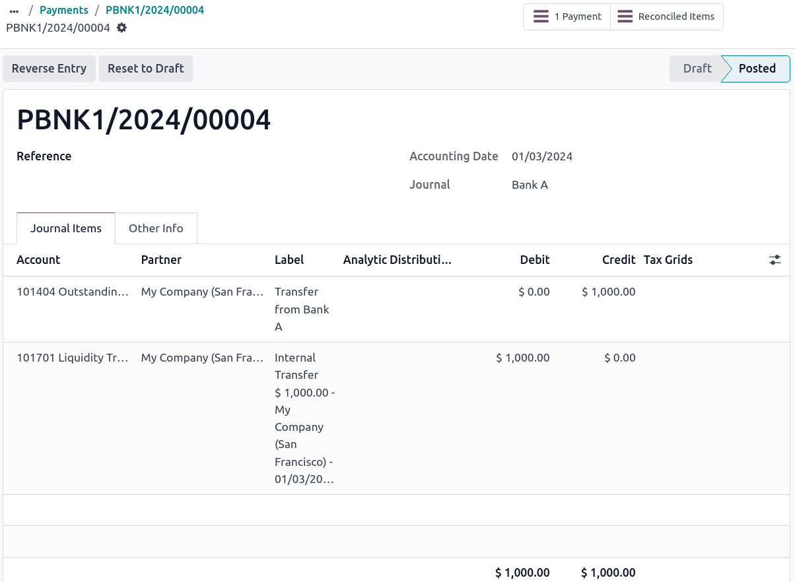
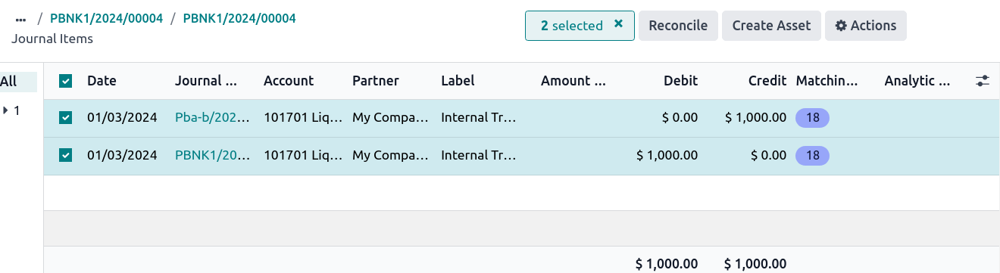

==================
Internal transfers
==================

Internal money transfers can be handled in Odoo. At least two bank accounts are needed to make
internal transfers.

.. seealso::
   :doc:`How to add an additional bank account <../bank>`

Configuration
=============

An internal transfer account is automatically created on your database based on your company's
localization and depending on your country’s legislation. If needed, the default :guilabel:`Internal
transfer account` can be modified by going to :menuselection:`Accounting --> Configuration -->
Settings --> Default Accounts section`.

Register an internal transfer from one bank to another
======================================================

Log an internal transfer
------------------------

If you want to transfer 1000 USD from Bank A to Bank B, from the Accounting Dashboard, click on the
drop-down selection button (:guilabel:`⋮`) on one of your banks, then click on :guilabel:`Payments`.
Each payment can be marked as :guilabel:`Internal Transfer`, however, a :guilabel:`Destination Journal`
must be selected in order to :guilabel:`Confirm` the internal transfer.

.. note::
  You can only make **internal transfers** on *unposted* payments.

.. image:: internal_transfers/transfer-check.png
   :align: center
   :alt: Internal transfer activation

The money is now booked in the transfer account and another payment is automatically created in the
destination journal.

Bank journal (Bank A)
~~~~~~~~~~~~~~~~~~~~~

.. list-table::
   :header-rows: 1
   :stub-columns: 1

   * - **Account**
     - **Debit**
     - **Credit**
   * - Outstanding Payments account
     -
     - $1,000
   * - **Internal transfer account**
     - **$1,000**
     -

Automated booking - Bank journal (BANK B)
~~~~~~~~~~~~~~~~~~~~~~~~~~~~~~~~~~~~~~~~~

.. list-table::
   :header-rows: 1
   :stub-columns: 1

   * - **Account**
     - **Debit**
     - **Credit**
   * - Outstanding Receipts account
     - $1,000
     -
   * - **Internal transfer account**
     -
     - **$1,000**

.. note::
   There is one outstanding payment and one outstanding receipt pending in your two bank account
   journals, because the bank statement confirming the sending and receiving of the money has not
   been booked yet.

Internal transfer reconciliation
--------------------------------

By clicking on the :guilabel:`Journal Entry` button in the payment form, the journal items detail
can be seen.

From this form, you can click on the :guilabel:`Reconciled Items` to access the internal transfer
reconciliation, select both and then click on :guilabel:`Reconcile`.

.. seealso::
   :doc:`../bank/reconciliation`

Bank journal entry
~~~~~~~~~~~~~~~~~~

.. list-table::
   :header-rows: 1
   :stub-columns: 1

   * - **Account**
     - **Debit**
     - **Credit**
   * - Outstanding Payment
     - $1,000
     -
   * - Bank Account (BANK A)
     -
     - **$1,000**

The same steps must be repeated once you receive the bank statement related to Bank B. Book and
reconcile your bank statement lines.

Bank journal entry
~~~~~~~~~~~~~~~~~~

.. list-table::
   :header-rows: 1
   :stub-columns: 1

   * - **Account**
     - **Debit**
     - **Credit**
   * - Outstanding Receipt
     -
     - $1,000
   * - Bank Account (BANK B)
     - **$1,000**
     -
