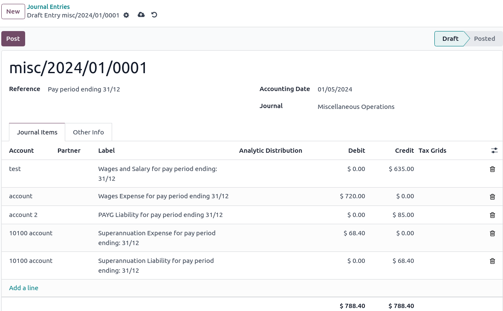

=======================
Employment Hero Payroll
=======================

If your business is already up and running with `Employment Hero <https://employmenthero.com/>`_,
you can use our connector as an alternative payroll solution.

The :guilabel:`Employment Hero Australian Payroll` module synchronizes payslip accounting entries
(e.g., expenses, social charges, liabilities, taxes) automatically from Employment Hero to Odoo.
Payroll administration is still done in Employment Hero, and  **journal entries** are recorded in
Odoo.

.. important::
   KeyPay was rebranded as **Employment Hero** in March 2023.

Configuration
=============

#. :ref:`Install <general/install>` the :guilabel:`Employment Hero Australian Payroll` module
   (`l10n_employment_hero`).
#. Configure the **Employment Hero API** by going to :menuselection:`Accounting --> Configuration
   --> Settings`. More fields become visible after clicking on :guilabel:`Enable Employment Hero
   Integration`.

   .. image:: employment_hero/employment-hero-integration.png
      :alt:   Enabling Employment Hero Integration in Odoo Accounting displays new fields in the
            settings

   - You can find the :guilabel:`API Key` in the :guilabel:`My Account` section of the Employment
     Hero platform.

     .. image:: employment_hero/employment-hero-myaccount.png
        :alt:   "Account Details" section on the Employment Hero dashboard

   - The :guilabel:`Payroll URL`, in Odoo, is left empty by default to avoid any confusion. Please
     fill it according to the documentation specific to your localization.

     .. note::
        Employment hero is available for :ref:`Australia <australia/employment-hero>`,
        :ref:`Malaysia <malaysia/employment-hero>`,
        :ref:`New Zealand <new-zealand/employment-hero>`,
        :ref:`Singapore <singapore/employment-hero>`,
        and the :ref:`United Kingdom <united-kingdom/employment-hero>`.

   - You can find the :guilabel:`Business ID` in the Employment Hero URL. (i.e., `189241`)

     .. image:: employment_hero/employment-hero-business-id.png
        :alt:   The Employment Hero "Business ID" number is in the URL

   - You can choose any Odoo journal to post the payslip entries.

How does the API work?
----------------------

The API syncs the journal entries from Employment Hero to Odoo and leaves them in draft. The
reference includes the Employment Hero payslip entry ID in brackets for the user to retrieve the
same record in Employment Hero and Odoo quickly.

By default, the synchronization happens once per week. You can fetch the records manually by going
to :menuselection:`Accounting --> Configuration --> Settings` and, in the :guilabel:`Enable
Employment Hero Integration` option, click on :guilabel:`Fetch Payruns Manually`.

Employment Hero payslip entries also work based on double-entry bookkeeping.

The accounts used by Employment Hero are defined in the section :guilabel:`Payroll settings`.

.. image:: employment_hero/employment-hero-chart-of-accounts.png
   :alt:   Chart of Accounts menu in Employment Hero

For the API to work, you need to create the same accounts as the default accounts of your Employment
Hero business (**same name and same code**) in Odoo. You also need to choose the correct account
types in Odoo to generate accurate financial reports.
