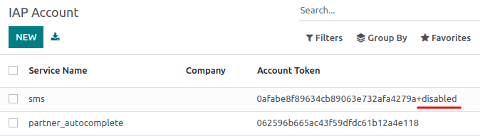

=====================
In-App Purchase (IAP)
=====================

In-App Purchases (IAP) grant access to additional services through Odoo. For instance, it allows the
sending of SMS text messages or invoices by post directly from a database.

IAP accounts
============

Credits for IAP services are stored on IAP accounts, which are specific to each service. By default,
IAP accounts are common to all companies, but can be restricted to specific ones.

To make changes to IAP accounts, activate Odoo’s :ref:`developer mode <developer-mode>`. Return to
the main apps page and type *IAP*. In the resulting drop-down menu select
:guilabel:`Settings / Technical / IAP / IAP Accounts`.

.. image:: in_app_purchase/image2.png
   :align: center
   :alt: The IAP Account menu showing IAP services, companies, and account tokens.

From the IAP Account page, click :guilabel:`NEW` to create new services. Click an existing service
to make changes such as the companies it applies to.

To disable an IAP account, click on the service and type `+disabled` at the end of the account token
. To re-enable the account, remove `+disabled` from the token.

IAP portal
==========

The IAP portal is a platform for managing all IAP services. Actions that can be performed in the
portal include checking an account's balance, buying more credits (recharge), and setting reminders
to be automatically notified when an account’s balance falls below a specified threshold. To access,
the IAP portal, go to the :menuselection:`Settings app --> Search "IAP" --> View My Services`.

.. image:: in_app_purchase/image3.png
   :align: center
   :alt: The Your Services page showing selected services, current balance, and the Recharge button.

.. _Buy credits:

Buying credits
==============

Each IAP service relies on prepaid credits to work and has its own pricing. To check an account’s
current balance or to buy more credits (:guilabel:`Recharge`), go to the
:menuselection:`Settings app --> Search "IAP" --> View My Services`.

.. image:: in_app_purchase/search-for-iap-in-settings.png
   :align: center
   :alt: General Settings and the In-App Purchases heading showing the View My Services button.

.. tip::
   Users who have the Enterprise version of Odoo Online get free credits to test IAP features.

Get notified when credits are low
=================================

To be notified when credits are low, go to the
:menuselection:`Settings app --> Search "IAP" --> View My Services`. Click on a service and check
the :guilabel:`Receive threshold warning` box. Enter a minimum credit amount in the
:guilabel:`Warning threshold` field. Finally, click :guilabel:`Change Email` and provide an email
address to be automatically notified when credits are at or below the :guilabel:`Warning threshold`.

.. image:: in_app_purchase/image4.png
   :align: center
   :alt: The Receive threshold warning box is checked and a Warning threshold is set.
