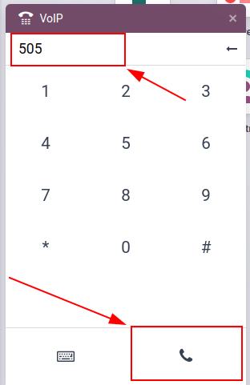

================
Conference calls
================

Conference calls help to connect employees quickly and efficiently, so that matters can be discussed
in a open forum. Attendees can be limited via a sign-in code to provide an additional layer of
security.

This document will cover the configuration of conference calls in Axivox for use in Odoo *VoIP*.

Add conference
==============

To add a a virtual conference room, first navigate to the `Axivox management console
<https://manage.axivox.com>`_. After logging in, click on :guilabel:`Conferences` in the left hand
menu. Next, click the green button labeled :guilabel:`Add a conference` and a form will appear.

Fill in the :guilabel:`Name` field and set an :guilabel:`Internal extension`. The internal extension
is what members of the network will use to quickly dial into the conference call, instead of typing
in the whole phone number.

.. tip::
   Try picking a number between three and five digits long, this way it can easily be dialed and
   remembered.

Next, if the conference room requires security, set the :guilabel:`Access code`. Immediately after
dialing the extension, a digital receptionist will prompt for the :guilabel:`Access code`.

Under the :guilabel:`Administrator extension`, click the drop-down and select the user's extension
that will manage the call. Finally, under :guilabel:`Wait for the administrator to start the
conference`, click the drop-down and select :guilabel:`Yes` or :guilabel:`No`. Should the selection
be :guilabel:`Yes`, then nobody will be allowed to utilize the virtual conference room until the
administrator is present and logged in to the :guilabel:`Conference`.

:guilabel:`Save` the changes, and :guilabel:`Apply changes` in the upper right to implement the
changes in production. The conference has now be added and the Axivox administrator has the option
to :guilabel:`Delete` or :guilabel:`Edit` the :guilabel:`Conference` from the Axivox
:guilabel:`Conference` main dashboard.

To invite a Axivox user to a specific :guilabel:`Conference`, click :guilabel:`Invite` and enter the
extension or phone number of the invitee. Once the extension or number is added into the field, then
click the green :guilabel:`Invite` button and the recipient will immediately receive a phone call
linking them to the conference automatically.

Incoming numbers
================

To open a conference to a wider audience, an Axivox :guilabel:`Conference` can be linked to
:guilabel:`Incoming numbers`. Log into the `Axivox management console <https://manage.axivox.com>`_
and click on :guilabel:`Incoming numbers`. Next, click :guilabel:`Edit` to the far right side of the
*incoming number* that the conference should be attached to. Under the first field, labeled,
:guilabel:`Destination type for voice call` click the drop-down and select :guilabel:`Conference`.
Finally, under :guilabel:`Conference`, click the drop-down and select the specific conference that
should be attached to this incoming number.

Whenever this incoming number is dialed, the caller is let into the conference if there isn't an
:guilabel:`Access code`. If an :guilabel:`Access code` has been set, the caller will be prompted to
enter it.

Starting call in Odoo
=====================

To initiate a conference call in Odoo, click on the VoIP widget in the upper right corner from any
window in the database, represented by a :guilabel:`☎️ (phone)` icon. Dial the specific extension
number for the :guilabel:`Conference` and click the :guilabel:`📞 (receiver)` icon.

After the digital receptionist answers, dial the :guilabel:`Access code` and press the pound [#]
icon.
