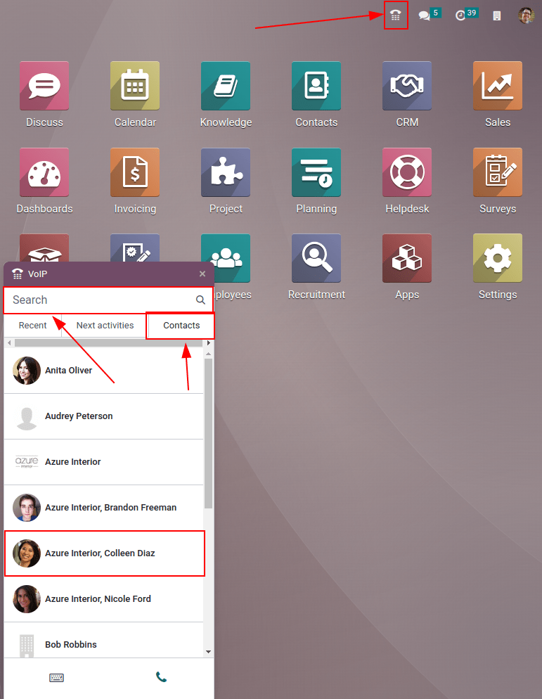
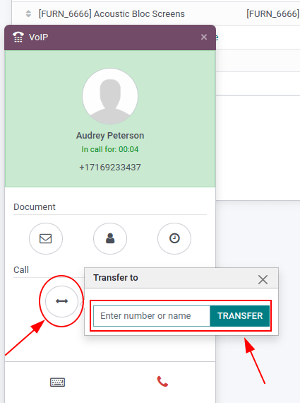

==========================================
Make, receive, transfer, and forward calls
==========================================

Call prospective clients, customers, or colleagues is an essential part of any business. A company
also needs to be available when the customer calls in, in order to build trust and make connections.
This document will cover how to make, receive, transfer, and forward calls with *VoIP*.

Make calls
==========

Starting on the Odoo dashboard, a call can be made by clicking on the :guilabel:`phone widget` in
the upper right corner. The widget is represented by a :guilabel:`☎️ (phone)` icon. A user can click
the :guilabel:`Contacts` tab and click into any contact in the database to make a call quickly.

Additionally, one can also use the :guilabel:`Search bar` to find and of the contacts in a quick and
easy manner.

To manually make a call click into the :guilabel:`⌨️ (keyboard)` icon and manually key in the
number. Enter the plus (+) sign first, followed by the international country code.

.. example::
   For the United States of America, the country code and plus (+) sign would look like this: `+1`.
   For Belgium, the number would be prefixed by `+32` and for Great Britain it would be `+44`.

After entering the full number in with the plus (+) sign and country code, then simply click the
:guilabel:`📞 (green phone)` icon to start the call, and then click the :guilabel:`📞 (red phone)`
icon to end the call.

.. image:: transfer_forward/manual-call.png
   :align: center
   :alt: Using the VoIP phone widget to make calls.

Receive calls
=============

Receive calls into the Odoo :guilabel:`phone widget` easily. An incoming call will open up the
:guilabel:`phone widget` when a user in using the Odoo database. Should the database be open in an
open tab, then a sound will play should the sound be activated on the device. Once back to the tab,
the calling screen of the :guilabel:`phone widget` will appear.

Click the :guilabel:`📞 (green phone)` icon to pick up or the :guilabel:`📞 (red phone)` icon to
reject the call.

.. image:: transfer_forward/incoming-call.png
   :align: center
   :alt: Incoming call on the VoIP widget, with the call answer and call reject buttons highlighted.

Add to call queue
=================

Keeping track of calls that need to be made on any given day can be cumbersome, but using the phone
widget activities tracker calling is streamlined. All the contacts and customers that need to be
made can be seen in one simple place on the Odoo phone widget, under the :guilabel:`Next activities`
tab.

To add a call to the :guilabel:`Next activities` tab simply click the :guilabel:`📞 (green phone)`
icon in kanban view of the *CRM* application. To remove them again from the call queue, just hover
over the opportunity with a call scheduled, and click on the :guilabel:`📞 (red phone)` icon that
appears with the minus [-] icon. When navigating back to the *phone widget* only the calls that are
scheduled immediately for that day will appear in the queue under the :guilabel:`Next Activities`
tab.

.. image:: transfer_forward/add-call-queue.png
   :align: center
   :alt: Adding a call to the next activities tab in the VoIP phone widget.

*Next activities* integration with the :guilabel:`phone widget` works with the following apps:
*CRM*, *Project*, *Helpdesk*. A call can be added in the chatter of these records. To manually add a
call via the chatter, click :guilabel:`Activities` next to the :guilabel:`🕗 (clock)` icon. Under
:guilabel:`Activity Type`, select :guilabel:`Call` from the drop-down. Next, set a :guilabel:`Due
Date` and add a :guilabel:`Summary`. Lastly, change the :guilabel:`Assigned to` field to the person
that should make the call. Whomever is set in this last field (:guilabel:`Assigned to`), will have
this call show up in their :guilabel:`Next Activities` call queue in the :guilabel:`phone widget`.

.. important::
   Only calls for the current day will appear in the :guilabel:`Next Activities` tab of the
   :guilabel:`phone widget` for the specific user.

If specified, click :guilabel:`Save` or :guilabel:`Open Calendar` to complete scheduling the call.

Transfer calls
==============

A call can be transferred from one user to another in the :guilabel:`phone widget`. This can only
occur after speaking to the caller first. Without picking up the call in the :guilabel:`phone
widget`, the only way to transfer a call is automatically though the provider console/portal.

.. seealso::
   :ref:`axivox/forwardings_tab`

To transfer a call within the :guilabel:`phone widget`, first, answer the call using the
:guilabel:`📞 (green phone)` icon. Once the incoming call is answered, then click on the
:guilabel:`↔ (left-right arrow)` icon. Now, enter the extension of the user that the call should be
forwarded to. Finally, click :guilabel:`Transfer` to route the call to the phone number.

.. tip::
   To find the extension for a user, consult the :abbr:`VoIP (Voice over Internet Protocol)`
   administrator or if the user has Settings access rights to Administration, then navigate to
   :menuselection:`Settings App --> Manage Users --> Select the user --> Preferences --> VOIP -->
   VoIP username / Extension number`.

   For more information on access rights visit: :doc:`../users/access_rights`

Forward calls
=============

To forward a call within the :guilabel:`phone widget`, first, answer the call using the
:guilabel:`📞 (green phone)` icon. Once the incoming call is answered, then click on the
:guilabel:`↔ (left-right arrow)` icon. Next, enter the full phone number of the user that the call
should be forwarded to. Finally, click :guilabel:`Transfer` to route the call to the phone number.

.. seealso::
  :ref:`axivox/forwardings_tab`.
