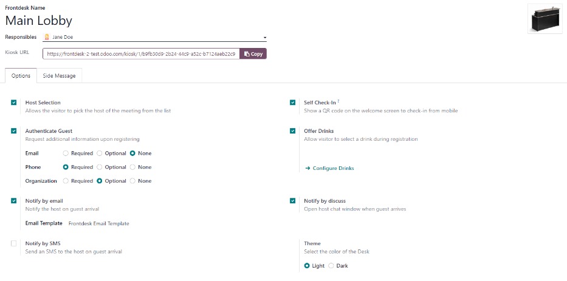
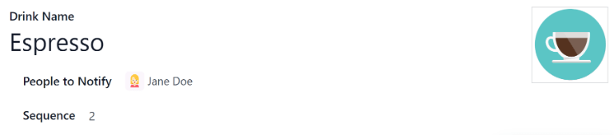
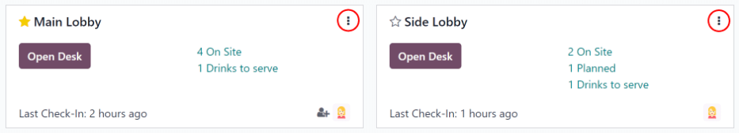
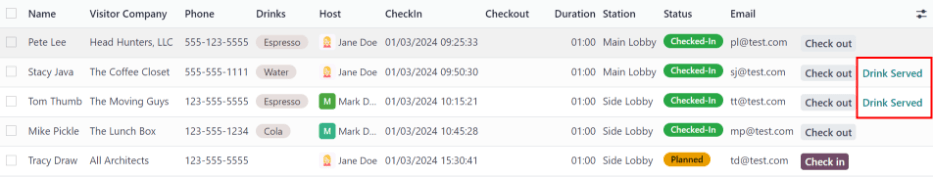

=========
Frontdesk
=========

The Odoo *Frontdesk* application is a way for visitors to check in to a building or location and
alert the person they are seeing that they have arrived. Additionally, they can request a
pre-configured beverage, to be brought to them while they wait. This application is ideal for
businesses that do not have someone working at a reception desk, or perhaps do not have a lobby or
waiting area available to guests and visitors.

Configuration
=============

The first item to be configured to use the *Frontdesk* application is the station or stations,
followed by the drinks that are offered.

Stations
--------

A **Station** can be thought of as any location where someone can sign-in and wait for an employee.
This is typically some form of waiting room, such as a lobby. Each station has a kiosk where
visitors check in. There is a minimum of one station that must be configured to use the *Frontdesk*
application, but there is no limit to how many stations that can created and configured.

To create a station, navigate to :menuselection:`Frontdesk application --> Configuration -->
Stations` and click :guilabel:`New`. A blank frontdesk form loads. Enter the following information
on the form:

- :guilabel:`Frontdesk Name`: enter the name for the specific Frontdesk location. This should be
  short and identifiable, such as `Reception Desk` or `Main Lobby`. This field is required in order
  to create a station.
- :guilabel:`Responsibles`: select the person or persons who are alerted when a visitor checks in
  using at specific frontdesk. Multiple selections can be entered. This field is required in order
  to create a station.
- :guilabel:`Kiosk URL`: after both the :guilabel:`Frontdesk Name` and :guilabel:`Responsibles` are
  populated, the form can be saved manually. Click the :guilabel:`Save Manually` icon (a cloud with
  an up arrow inside it) and the :guilabel:`Kiosk URL` field populates. This URL is one way the
  frontdesk kiosk is accessed. To access the kiosk, click the :guilabel:`Copy` button at the end of
  the URL, and navigate to that URL in a web browser. This URL opens that specific stations'
  frontdesk sign-in page.

Options tab
~~~~~~~~~~~

.. _frontdesk/host:

- :guilabel:`Host Selection`: if the visitor is attending a meeting, this option allows the visitor
  to select the meeting host from a presented list, and notify that individual.
- :guilabel:`Authenticate Guest`: if additional information is required when a guest checks-in,
  enable this option, and then select which of the following are required:

  - :guilabel:`Email`: select whether the guest's email address is :guilabel:`Required`,
    :guilabel:`Optional`, or if the information is not requested at all (:guilabel:`None`).
  - :guilabel:`Phone`: select whether the guest's phone number is :guilabel:`Required`,
    :guilabel:`Optional`, or if the information is not requested at all (:guilabel:`None`).
  - :guilabel:`Organization`: select whether the guest's organization is :guilabel:`Required`,
    :guilabel:`Optional`, or if the information is not requested at all (:guilabel:`None`).

- :guilabel:`Theme`: select the color mode of the kiosk. Chose either :guilabel:`Light` or
  :guilabel:`Dark`. The :guilabel:`Light` selection displays a pale gray background on the kiosk,
  whereas the :guilabel:`Dark` selection displays a dark gray and black background.
- :guilabel:`Self Check-In`: enable this option to present a check-in QR code on the kiosk. The QR
  code allows guests to check in using their mobile device instead of using the kiosk. This option
  is recommended for a busy kiosk with multiple guests checking in at any time.
- :guilabel:`Offer Drinks`: enable this option to offer guests a drink upon check-in. If this option
  is enabled, it is necessary to :ref:`configure the drinks being offered <frontdesk/drinks>`. Once
  all drink options are configured, select each drink to be offered using the drop-down menu.

.. note::
   The following options are only visible in the :guilabel:`Options` tab if the :ref:`Host Selection
   <frontdesk/host>` setting is activated.

- :guilabel:`Notify by email`: enable this option to have an email sent to the person the guest is
  visiting upon check-in. When enabled, the default :guilabel:`Frontdesk Email Template` is
  selected. To change the default email template to be used, click the drop-down menu and select
  another email template. To modify the currently selected template, click the :guilabel:`Internal
  link` arrow at the end of the line, and make any edits to the template. The email subject,
  content, attachments, configurations and settings can all be modified.
- :guilabel:`Notify by SMS`: enable this option to have an SMS (text) message sent to the person the
  guest is visiting upon check-in. When enabled, the default :guilabel:`Frontdesk SMS Template` is
  selected. To change the default SMS template to be used, click the drop-down menu and select
  another SMS template. To modify the currently selected template, click the :guilabel:`Internal
  link` arrow at the end of the line, and make any edits to the content of the template. The SMS
  message may have a maximum of 242 characters, which fits in 4 SMS (UNICODE) messages.
- :guilabel:`Notify by Discuss`: enable this option to have a *Discuss* application message window
  open with the person the guest is visiting upon check-in. When enabled, a default message appears
  for the person the guest is visiting. The *Discuss* application must be installed in order for
  this option to work. *Discuss* is installed by default when creating an Odoo database, and does
  not count towards billing. As long as the *Discuss* application is not intentionally uninstalled,
  this option works.

.. example::
   The default message format for the :guilabel:`Notify by Discuss` option is: `(Frontdesk Station)
   Check-In: (Guest Name) (Guest Phone Number) (Organization) to meet (Name of employee).`

   An example of how that might appear in a *Discuss* message is: `Main Lobby Check-In: John Doe
   (123-555-1234) (Odoo, Inc.) to meet Marc Demo.`

Side Message tab
~~~~~~~~~~~~~~~~

Enter any desired text to appear on the station kiosk after a guest has checked in, such as a
welcome greeting or any necessary instructions. The text appears on the confirmation page, on the
right side of the screen after a guest has completed the check-in process.

.. _frontdesk/drinks:

Drinks
------

After all the stations are created, the next step is to configure the drinks on offer, if desired.
This step is not necessary or required for the *Frontdesk* application to work, and only needs to be
configured if drinks are offered to guests.

To add a drink option, navigate to :menuselection:`Frontdesk application --> Configuration -->
Drinks`. Click :guilabel:`New` and a blank drink form loads. Enter the following information on the
form:

- :guilabel:`Drink Name`: type in the name of the drink option in the field. This field is required.
- :guilabel:`People to Notify`: use the drop-down and select who will be notified when the drink is
  selected. Multiple people can be entered in the field. This field is required.
- :guilabel:`Sequence`: enter a numerical value in this field to indicate where in the list of drink
  options this specific option appears. The lower the number, the higher on the list the drink
  appears. For example, entering the number one (1) would place that drink at the top of the list
  and be the first to appear in sequence.
- :guilabel:`Picture`: hover over the picture icon to reveal the :guilabel:`✏️ (pencil)` icon, and
  click on the :guilabel:`✏️ (pencil)` icon. A file navigator window appears. Navigate to the
  desired image file and select it, then click :guilabel:`Open`. The photo now appears in the
  picture field, and will be set as the background on the kiosk.

Stations
========

Upon opening the *Frontdesk* application, the dashboard displays all the configured stations. This
can also be accessed at any time in the *Frontdesk* application by navigating to
:menuselection:`Frontdesk application --> Stations`.

Each station is presented in its own rectangular station card. Each card displays the following
information:

- :guilabel:`Favorite`: click the star to mark the station as a favorite, click the star again to
  remove the favorite status. A yellow star indicates the station is a favorite.
- :guilabel:`Station Name`: the name of the specific station.
- :guilabel:`Open Desk` button: click this button to open the station page in a separate browser
  tab.
- :guilabel:`(X) On Site`: this indicates the total number of guests that are currently checked in.
  Click on this line to be taken to a list view of all visitors that are checked-in.
- :guilabel:`(X) Planned`: this indicates the total number of guests that are planned to arrive that
  day. Click on this line to be taken to a list view of all visitors that are planned to arrive.
- :guilabel:`(X) Drinks to serve`: this indicates the total number of drinks that have been
  requested by checked-in guests, but have not been delivered and marked as served yet. Click on
  this line to be taken to a list view of all visitors that are waiting for their drink to be
  served.
- :guilabel:`Last Check-In`: this indicates how long ago the last check-in took place, in hours
  and/or minutes.
- :guilabel:`Additional options menu`: click this to reveal a drop-down menu, to access either the
  :guilabel:`Kiosk` in a separate tab, the full list of planned and/or checked-in
  :guilabel:`Visitors` for the current day, the :guilabel:`Statistics` for that station, or the
  :guilabel:`Configuration` options for that particular station.
- :guilabel:`Assign`: the user who is notified when someone checks-in at this station. Add another
  user by clicking the :guilabel:`Assign` icon and selecting any additional users desired.

Click on any station card to navigate to a complete list of all visitors associated with that
particular station, past, present, and future.

.. _frontdesk/visitors:

Visitors
========

To access a complete list of visitors that are currently checked in, navigate to
:menuselection:`Frontdesk application --> Visitors`. The visitors are listed in a list view, with
the following details that were entered when they checked-in:

- :guilabel:`Name`: the guest's name.
- :guilabel:`Visitor Company`: the guest's company they represent.
- :guilabel:`Phone`: the guest's phone number.
- :guilabel:`Drinks`: the drink the guest requested.
- :guilabel:`Host`: who the guest is waiting to see.
- :guilabel:`CheckIn`: the date and time the guest checked in.
- :guilabel:`Checkout`: the date and time the guest checked out. In the default view, only guests
  with a :guilabel:`Checked-In` or :guilabel:`Planned` status are visible. Guests with check-out
  times are only visible if the filter :guilabel:`Today` is not active.
- :guilabel:`Duration`: the current amount of time the guest has been checked in for.
- :guilabel:`Station`: the location of where the guest checked in.
- :guilabel:`Status`: the status of the guest. The options are :guilabel:`Checked-In`,
  :guilabel:`Planned`, :guilabel:`Checked-Out`, or :guilabel:`Cancelled`. In the default view, only
  guests with a :guilabel:`Checked-In` or :guilabel:`Planned` status are visible.
- :guilabel:`Email`: the guest's email address.
- Status Column: when a guest leaves, click the :guilabel:`Check out` button to update the guest's
  record and log the date and time they left. If a scheduled guest arrives, if they did not check-in
  using the *Frontdesk* application kiosk, they can be checked-in on the visitor log. Click
  :guilabel:`Check in` to log the date and time they arrived.
- :guilabel:`Drink Served`: then a guest requests a drink, the :guilabel:`Drink Served` button
  appears at the end of the visitor line. When a drink has been served, click the :guilabel:`Drink
  Served` button to indicate the drink has been delivered to the guest.

If any column is not visible, or if a visible column is preferred to be hidden, click on the
additional options icon at the end of the column name list. Click on the option to enable or disable
any desired columns. A check mark indicates the column is visible.

Planned visitors
----------------

If a guest is expected to arrive at a future date and time, it is possible to enter their
information into the *Frontdesk* application in advance. To create a planned guest, navigate to
:menuselection:`Frontdesk application --> Visitors  --> New`. Enter the same information as any
other :ref:`visitor <frontdesk/visitors>`. The only required fields are the visitor's
:guilabel:`Name` and the :guilabel:`Station` they are expected at.

.. important::
   If a guest is planned in advance, they must be checked in from the visitors' list in the
   *Frontdesk* application. If a planned guest checks in using a kiosk, they will be checked in
   separately, and their planned visitor entry will remain listed as :guilabel:`Planned`.

   Only when a planned guest is checked-in inside the application's visitor list, their
   :guilabel:`Planned` status changes to :guilabel:`Checked-In`.

   If a guest does check-in using a kiosk, ensure all records are current, and the list of
   currently on-site guests is correct. Be sure to check in and/or check-out the correct entries so
   the visitor lists correctly reflects who is currently on the premises.

   Ensure that planned guests are informed that they should not check-in using the kiosk if they are
   listed as a planned guest in advance.

Frontdesk flow
==============

The first thing to do after configuring the various stations is to set up each kiosk for use. It is
recommended to use a dedicated device for each frontdesk kiosk, such as a tablet.

Navigate to the kiosk in one of two ways:

- Navigate to the main *Frontdesk* application dashboard, and click the :guilabel:`Open Desk`
  button on the specific station. The kiosk loads in a new browser window.
- Navigate to :menuselection:`Frontdesk application --> Configuration --> Stations` and click on the
  specific station. Click the :guilabel:`Copy` button at the end of the :guilabel:`Kiosk URL` line,
  and paste the URL into a new browser tab or window.

.. important::
   It is recommended to log out of the database and close the tab after navigating to the kiosk, so
   there is no possibility of a visitor accessing the database when checking-in.

Visitor flow
------------

When a visitor arrives at a facility, they approach a frontdesk kiosk, and enter their information.
The information requested is what was configured for that specific frontdesk station. If any
information is required, the field displays a red asterisk (*). The visitor must enter information
in order to check in. Once all the information is entered, the visitor taps the :guilabel:`Check In`
button.

If drinks were configured for the station, after tapping :guilabel:`Check In`, a registration
confirmation screen loads, along with the question `Do you want something to drink?`. The visitor
can tap either :guilabel:`Yes, please`, or :guilabel:`No, thank you`. If they select :guilabel:`Yes,
please`, a drink selection screen appears, and the pre-configured options are listed. The visitor
then taps the desired selection, or if they do not want anything, they can tap the
:guilabel:`Nothing, thanks` button at the bottom of the screen. If a drink selection was made, a
`Thank you for registering! Your drink is on the way.` message appears.

At any point in the check-in process, if ten (10) seconds pass with no selection, the kiosk
returns to the main welcome screen.

Once the visitor has checked in, both the person they are visiting, and any users who were
configured to be notified when anyone checks-in at the kiosk are notified. The notification is
either by email, SMS message, a *Discuss* chat, or any combination of those three options.

If the visitor requested a drink, the user or users who were configured as the :guilabel:`People to
Notify` on the drink form, are notified via the *Discuss* application. The message that appears is:
`(Visitor Name) just checked-in. They requested (drink).`

Once the drink has been delivered to the guest, the person who delivered the drink is responsible
for marking the drink as delivered. To do this, navigate to :menuselection:`Frontdesk application
--> Stations --> (X) Drinks to serve`. This opens a list of all the visitors who checked-in at that
station, and are waiting for a drink. Click the :guilabel:`Drink Served` button at the end of the
line for the visitor who was served. Once they are marked as having their drink served, the visitor
disappears from the list.

Visitors do **not** check themselves out when they leave. Once the visitor completed their business
and has left the premises, it is important to check them out for accurate record keeping. Navigate
to :menuselection:`Frontdesk application --> Stations --> (X) On Site`. This opens a list of all the
visitors who are currently checked-in at that station. Click the :guilabel:`Check Out` button near
the end of the line for the visitor who left. Once they are marked as checked-out, the visitor
disappears from the list.

.. important::
   Always have an accurate list of who is on the premises at any given time. Since visitors do not
   check themselves out, it is important for accurate record keeping to check-out visitors when they
   leave. This is important both in the case of an emergency, and for security purposes.

Reporting
=========

The *Frontdesk* application has two reports available, :guilabel:`Visitors` and :guilabel:`Drinks`.
To access either of these reports, navigate to :menuselection:`Frontdesk application --> Reporting
--> Visitors or Drinks`.

The :guilabel:`Visitors` report displays the number of visitors by month, for the current year. The
:guilabel:`Drinks` report shows how many total requests were made for each drink.

As with all reports in Odoo, the filters and groups can be modified to show other metrics.
