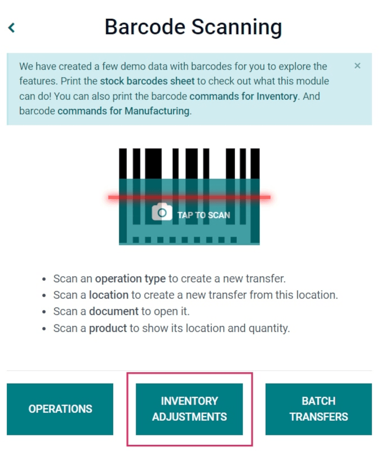

=========================================
Apply inventory adjustments with barcodes
=========================================

In a warehouse, the recorded inventory counts in the database might not always match the actual,
real inventory counts. In such cases, inventory adjustments can be made to reconcile the
differences, and ensure that the recorded counts in the database match the actual counts in the
warehouse. In Odoo, the *Barcode* app can be used to make these adjustments.

These adjustments can be done from scratch in real time using an Odoo-compatible barcode scanner or
the Odoo mobile app.

For a list of Odoo-compatible barcode mobile scanners, and other hardware for the *Inventory* and
*Barcode* apps, refer to the `Odoo Inventory • Hardware page
<https://www.odoo.com/app/inventory-hardware>`_.

.. seealso::
   :doc:`../../management/inventory_adjustments/count_products`

Enable Barcode app
==================

To use the *Barcode* app to create and apply inventory adjustments, it **must** be installed by
enabling the feature from the settings of the *Inventory* app.

To do so, go to the :menuselection:`Inventory app --> Configuration --> Settings`. Then, scroll down
to the :guilabel:`Barcode` section, and click the checkbox next to the :guilabel:`Barcode Scanner`
feature.

Once the checkbox is ticked, click :guilabel:`Save` at the top of the page to save changes.

Once the page has refreshed, new options are displayed under the :guilabel:`Barcode Scanner`
feature: :guilabel:`Barcode Nomenclature` (with a corresponding drop-down menu), where either
:guilabel:`Default Nomenclature` or :guilabel:`Default GS1 Nomenclature` can be selected. The
selected nomenclature changes how scanners interpret barcodes in Odoo.

There is also a :guilabel:`Configure Product Barcodes` internal link arrow, along with a set of
:guilabel:`Print` buttons for printing barcode commands and a barcode demo sheet.

.. image:: adjustments/adjustments-barcode-setting.png
   :align: center
   :alt: Enabled Barcode feature in Inventory app settings.

For more on setting up and configuring the :guilabel:`Barcode` app, refer to the :doc:`Set up your
barcode scanner </applications/inventory_and_mrp/inventory/barcode/setup/hardware>` and
:doc:`Activate the Barcodes in Odoo
</applications/inventory_and_mrp/inventory/barcode/setup/software>` documentation pages.

Create and apply inventory adjustment
=====================================

To scan product barcodes and apply inventory adjustments, navigate to the :menuselection:`Barcode
app`.

Once inside the *Barcode* app, a :guilabel:`Barcode Scanning` screen displaying different
options is presented.

To create and apply inventory adjustments, click on the :guilabel:`Inventory Adjustments` button at
the bottom of the screen.

Doing so creates a new adjustment, and navigates to the :guilabel:`Barcode Inventory Client Action`
page, with :guilabel:`Inventory Adjustment` at the top of the form.

To begin the adjustment, first scan the *source location*, which is the current location in the
warehouse of the product whose count should be adjusted. Then, scan the product barcode(s).

The barcode of a specific product can be scanned multiple times to increase the quantity of that
product in the adjustment.

.. tip::
   If the warehouse *multi-location* feature is **not** enabled in the database, a source location
   does not need to be scanned. Instead, simply scan the product barcode to start the inventory
   adjustment.

Alternatively, the quantity can be changed by clicking the :guilabel:`pencil` icon on the far right
of the product line.

Doing so opens a separate window with a keypad. Edit the number in the :guilabel:`Quantity` line to
change the quantity. Additionally, the :guilabel:`+1` and :guilabel:`-1` buttons can be clicked to
add or subtract quantity of the product, and the :guilabel:`number keys` can be used to add
quantity, as well.

.. example::
   In the below inventory adjustment, the source location `WH/Stock/Shelf/2` was scanned, assigning
   the location. Then, the barcode for the product `[FURN_7888] Desk Stand with Screen` was scanned
   3 times, increasing the units in the adjustment. Additional products can be added to this
   adjustment by scanning the barcodes for those specific products.

   .. image:: adjustments/adjustments-barcode-inventory-client-action.png
      :align: center
      :alt: Barcode Inventory Client Action page with inventory adjustment.

To complete the inventory adjustment, click the green :guilabel:`Apply` button with the check mark
at the bottom of the page.

Once applied, Odoo navigates back to the :guilabel:`Barcode Scanning` screen. A small green banner
appears in the top right corner, confirming validation of the adjustment.

.. admonition:: Did you know?

   Odoo's *Barcode* application provides demo data with barcodes to explore the features of the app.
   These can be used for testing purposes, and can be printed from the home screen of the app.

   To access this demo data, navigate to the :menuselection:`Barcode app` and click :guilabel:`stock
   barcodes sheet` and :guilabel:`commands for Inventory` (bolded and highlighted in blue) in the
   information pop-up window above the scanner.

   .. image:: adjustments/adjustments-barcode-stock-sheets.png
      :align: center
      :alt: Demo data prompt pop-up on Barcode app main screen.

Manually add products to inventory adjustment
=============================================

When the barcodes for the location or product are not available, Odoo *Barcode* can still be used to
perform inventory adjustments. To do this, first navigate to the :menuselection:`Barcode app`.

Once inside the :guilabel:`Barcode app`, a :guilabel:`Barcode Scanning` screen displaying different
options is presented. Create a new inventory adjustment by clicking the :guilabel:`Inventory
Adjustments` button at the bottom of the screen.

This navigates to a new, blank :guilabel:`Barcode Inventory Client Action` page, with
:guilabel:`Inventory Adjustment` at the top of the form.

To manually add products to this adjustment, click the white :guilabel:`Add Product` button at the
bottom of the screen.

This navigates to a new, blank page where the desired product, quantity, and source location must be
chosen.

   .. image:: adjustments/adjustments-keypad.png
      :align: center
      :alt: Keypad to add products on Barcode Inventory Client Action page.

First, click the :guilabel:`Product` line, and choose the product whose stock count should be
adjusted. Then, manually enter the quantity of that product, either by changing the `1` in the
:guilabel:`Quantity` line, or by clicking the :guilabel:`+1` and :guilabel:`-1` buttons to add or
subtract quantity of the product. The :guilabel:`number keys` can be used to add quantity, as well.

Below the :guilabel:`number keys` is the :guilabel:`location` line, which should read `WH/Stock` by
default. Click this line to reveal a drop-down menu of locations to choose from, and choose the
:guilabel:`source location` for this inventory adjustment.

Once ready, click :guilabel:`Confirm` to confirm the changes.

To apply the inventory adjustment, click the green :guilabel:`Apply` button with the check mark, at
the bottom of the page.

Once applied, Odoo navigates back to the :guilabel:`Barcode Scanning` screen. A small green banner
appears in the top right corner, confirming validation of the adjustment.
