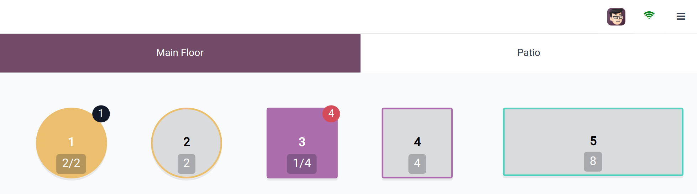

============================
Floors and tables management
============================

Floor plan
==========

To understand  the layout of your floor plan, keep the following keys in mind:

- Table 1: An order has been placed and sent to the kitchen.
- Table 3: An order of four items has been placed and needs to be sent to the kitchen.
- Tables 2, 4, and 5: These tables are available.
- Tables 2, 4, and 5: These tables' total capacity is, respectively, 2, 4, and 8 people.
- Table 1: The table of two is full.
- Table 3: The table of four is taken by one person.

Configuration
=============

From the POS settings
---------------------

To create floors and tables from the backend, :ref:`access your POS settings
<configuration/settings>` and click :guilabel:`→ Floors` under the :guilabel:`Restaurant Mode`
section's :guilabel:`Floors & Tables Map` category.

Then, click :guilabel:`New` to create a floor, name it, select the related point(s) of sales,
and click :guilabel:`Add a line` to create some tables. Name the table and assign a number of seats.
You can also link it to an appointment resource to make the table bookable. Once done, click
:guilabel:`Save & Close` or :guilabel:`Save & New` to confirm. Conversely, click :guilabel:`Discard`
to abort.

.. image:: floors_tables/table-creation-backend.png
   :scale: 75%

.. note::
   - Your POS must be :ref:`configured as a bar or restaurant <restaurant/configuration>` to display
     that section.
   - The POS must be opened and :ref:`edited from the frontend <floors_tables/frontend>` to
     create a map of your restaurant or bar reflecting your actual floor plan.

.. tip::
   Create floors on the spot: type your floor name into the :guilabel:`Floor` field of the
   :guilabel:`Floors & Tables Map` category and press *enter*.

   .. image:: floors_tables/floor-creation-backend.png
      :scale: 75%

.. _floors_tables/frontend:

From the POS frontend
---------------------

To create floors and tables from the frontend, :ref:`open a POS session <pos/session-start>`,
click the hamburger menu icon :guilabel:`≡` on the upper right corner, and :guilabel:`Edit Plan` to
enter the **edit mode**.

Add a floor by clicking :guilabel:`+ Add Floor`, which opens a pop-up window where you can choose a
name for it.

Once a floor is created, add a table by clicking :guilabel:`+ TABLE`. To move it, click it to select
it and drag and drop it as desired. Besides, you can also modify the attributes of the selected
table, such as the number of seats by clicking :guilabel:`SEATS`, the table shape using
:guilabel:`SHAPE`, the table color using :guilabel:`FILL`, or the table name by clicking
:guilabel:`RENAME`. To duplicate an existing table, select it and click :guilabel:`COPY`. You can
also remove a table by clicking :guilabel:`DELETE`.

After making all the necessary modifications, click :guilabel:`CLOSE` to save.

.. image:: floors_tables/floor-map.png

.. note::
   If no table is selected, the modifications are applied to the floor.

.. warning::
   Removing a table or a floor cannot be undone.

.. _floors_tables/orders:

Take orders
===========

Click a table to access the POS interface and start taking your customer's order. The system
automatically associates the orders and the table, allowing you to add more items later and generate
a bill specifically for this table's orders.

Upon placing an order, click :guilabel:`BACK` to return to the floor plan view and select another
table to register a new order.

.. note::
   As soon as you click a table, the number of guests is automatically set to one guest. If you
   mistakenly select a table, click :guilabel:`Release table` to free it or :ref:`transfer the
   customer <floors_tables/transfer>` to another table.

.. _floors_tables/transfer:

Table transfer
==============

To move customers from one table to another, select a table and click :guilabel:`→ Transfer` on the
POS interface. This redirects you to the floor plan view, where you can choose the new table to
which you want to transfer the customers.

When you transfer customers, all of the orders they have placed and that are linked to the original
table are also transferred.
