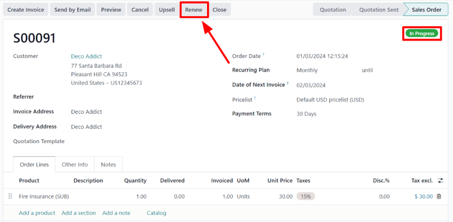
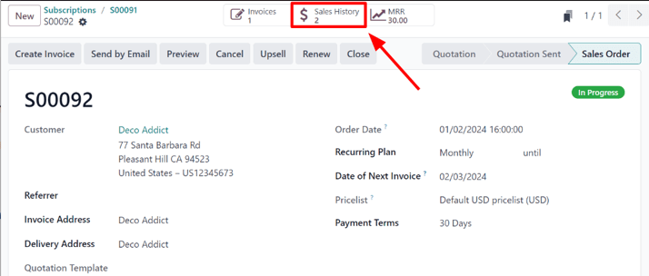
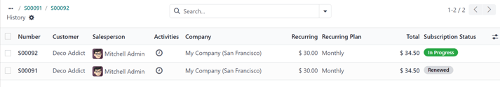

===================
Renew subscriptions
===================

The foundation of any subscription business model is recurring payments. That's when customers
reliably pay a regular amount at specific intervals, in exchange for access to a subscription
product or service.

The renewal of a subscription is the process followed by customers when they willingly choose to
continue their participation (and payment) for a subscription product or service.

Subscribers experience the renewal process at different intervals -- weekly, monthly, annually, etc.
-- depending on the duration of the agreed-upon contract.

Most companies that offer subscriptions prefer to automate the renewals process for customers, but,
in some cases, manual subscription renewals are still used.

With the Odoo *Subscriptions* application, a company can accurately manage all subscription renewals
in a single platform. Users can even filter all current subscriptions to quickly locate customers
who need to renew.

Subscription renewals
=====================

In order to renew a subscription, a quotation with a subscription product(s)/service(s) **must** be
confirmed, with a configured :guilabel:`Recurring Plan` selected, which turns it into a sales order.

Then, that sales order needs to be confirmed, and payment from the customer for the initial
subscription has to be invoiced and registered.

When those steps are complete, an :guilabel:`In Progress` tag is applied to the sales order form,
and a series of buttons appear at the top of the sales order -- including a button titled,
:guilabel:`Renew`.

When the :guilabel:`Renew` is clicked, Odoo instantly presents a new renewal quotation, complete
with a :guilabel:`Renewal Quotation` tag.

.. image:: renewals/renewal-quotation.png
  :align: center
  :alt: Renewal quotation in the Odoo Subscriptions application.

From here, a standard sales flow can occur, which is typically started by clicking :guilabel:`Send
by Email`. This sends a copy of the quotation to the customer for them to confirm, and eventually,
pay for.

.. note::
  In the *Chatter* of the :guilabel:`Renewal Quotation`, it is mentioned that this subscription is
  the renewal of the subscription from the original sales order.

Once the :guilabel:`Renewal Quotation` is confirmed, it becomes a sales order, and a
:guilabel:`Sales History` smart button appears at the top of the page.

When that :guilabel:`Sales History` smart button is clicked, Odoo reveals a separate page,
showcasing the different sales orders attached to this subscription, along with their individual
:guilabel:`Subscription Status`.

.. seealso::
   - :doc:`../subscriptions`
   - :doc:`plans`
   - :doc:`products`
